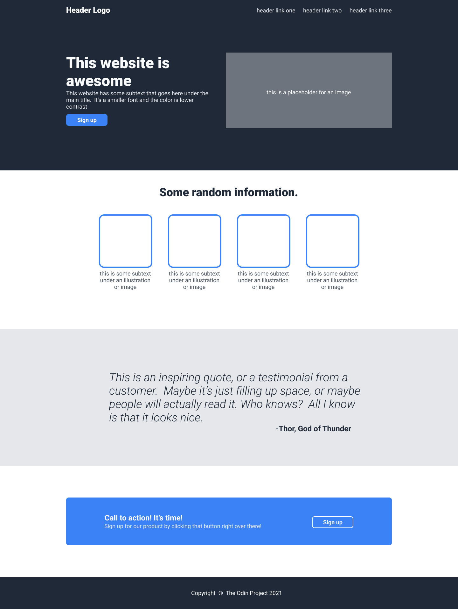

# landing-page-theodinproject
Landing page for the odin project guideline

# Preview given for reference 

# Assignment
# Landing Page Project

[**Download the full design image**](https://cdn.statically.io/gh/TheOdinProject/curriculum/81a5d553f4073e593d23a6ab00d50eef8620796d/foundations/html_css/project/imgs/01.png) and take a look at what you’re going to be creating.

Some fonts, colors and sizes are as follows (feel free to use your own if you wish):

## Design Specifications

* **Font:** `Roboto`

  * You will need to download and install this font if you don’t already have it.

* **Dark background color** (header, hero section and footer):

  * `#1F2937`

* **Logo text:**

  * Font size: `24px`
  * Color: `#F9FAF8`

* **Hero section main text** (“This website is awesome”):

  * Font size: `48px`
  * Color: `#F9FAF8`
  * Weight: `900`

* **Hero secondary text** (“This website has some subtext…”) and header links:

  * Font size: `18px`
  * Color: `#E5E7EB`

* **Button and Call to Action background color:**

  * `#3882F6`

* **Information heading:**

  * Font size: `36px`
  * Color: `#1F2937`
  * Weight: `900`

* **Quote:**

  * Background color: `#E5E7EB`
  * Font size: `36px`
  * Color: `#1F2937`
  * Weight: `300`
  * Font style: `italic`

## Instructions

1. There are many ways to tackle a project like this, and it can be overwhelming to look at a blank HTML document and not know where to start.

   Our suggestion: take it one section at a time. The website you’re creating has **4 main sections (and a footer)**, so pick one and get it into pretty good shape before moving on.

   Starting at the top is always a solid plan.

2. For the section you’re working on, begin by getting **all the content onto the page before beginning to style it**.

   In other words, do the **HTML first** and *then* do the **CSS**.

   You’ll probably have to go back to the HTML once you start styling, but bouncing back and forth from the beginning will take more time and may cause more frustration.

   > **Note:** You don’t need to use more than one stylesheet. Using only one CSS file is adequate for this project.

3. Many of the elements on this page are very similar to things you saw in our **Flexbox exercises**. Feel free to go back to those if you need a refresher.

4. You do **not** need to make this project responsive.

   That means you don’t have to adjust your design for:

   * Different screen sizes
   * Zoom levels
   * Mobile devices

   For now, just focus on making it look good on a regular computer screen. You’ll learn how to handle different screen sizes later.

5. When you finish, don’t forget to **push it up to GitHub!**

## Viewing Your Project on the Web

To share your website with others, you’ll need to **deploy it using GitHub Pages**.

## All images were taken from
[Magnific](https://www.magnific.com/serie/113183497#from_element=series_block)

## All icons were taken from
[Magnific](https://www.magnific.com/icon/listen_2781881#fromView=search&page=1&position=11&uuid=3d043f3f-9e61-4981-b8d7-88b413100765)